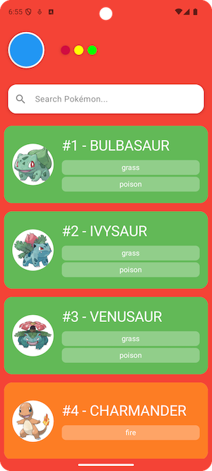

# 🏆 Pokémon Pokedex App

A clean and simple **Pokédex** app built using **Kotlin, Jetpack Compose, and Clean Architecture**. This app allows users to search for Pokémon and view detailed information about them.

---

## 📌 Features
✅ Search for Pokémon by name  
✅ Display Pokémon list with images, types, and stats  
✅ Fetch Pokémon details from the PokéAPI  
✅ Built using **Jetpack Compose** for a modern UI  
✅ Uses **Clean Architecture + MVVM Pattern**

---

## 🛠️ Tech Stack
- **Kotlin** - Modern programming language for Android development
- **Jetpack Compose** - Declarative UI toolkit for building native UIs
- **Hilt (Dagger Hilt)** - Dependency Injection
- **Retrofit** - API networking
- **Coroutines + Flow** - Asynchronous programming
- **MockK + JUnit** - Unit testing framework
- **PokéAPI** - Data source for Pokémon details

---

## 🚀 Installation
Clone the repository and open it in **Android Studio**:
```sh
git clone https://github.com/your-username/pokemon-pokedex-app.git
cd pokemon-pokedex-app
```

