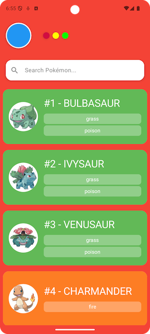
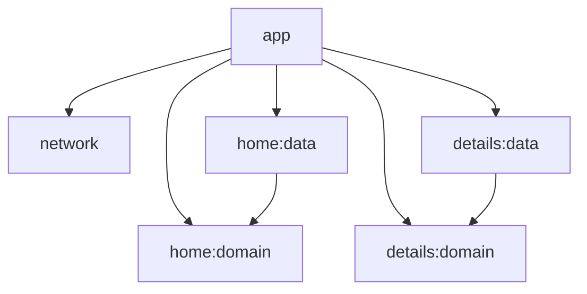

# DroidPokedex

[](https://github.com/alexrodrigues/droidpokedex/actions/workflows/ci.yml)

A Pokédex app for browsing and searching Pokémon using the public [PokéAPI](https://pokeapi.co/). It is built with **Kotlin**, **Jetpack Compose** (Material 3), **Navigation Compose**, and **Hilt** for dependency injection. The project follows a **multi-module, layered structure** (domain / data per feature, shared networking) inspired by Clean Architecture.



## Features

- Paginated Pokémon list with types and artwork (images via **Coil**)
- Search by name
- Detail screen with stats and metadata
- **Remote-first**: all Pokémon data is loaded over HTTPS; there is no local database or offline cache in this codebase

## Requirements

| Item | Version |
|------|---------|
| JDK | 17 |
| `minSdk` | 24 |
| `compileSdk` / `targetSdk` | 36 |

Use a recent **Android Studio** version compatible with the Android Gradle Plugin declared in [`gradle/libs.versions.toml`](gradle/libs.versions.toml) (currently **8.13.0**).

## Getting started

Clone the repository and open the project in Android Studio, or build from the command line:

```sh
git clone https://github.com/alexrodrigues/droidpokedex.git
cd droidpokedex
./gradlew :app:assembleDebug
```

Run unit tests (includes Paparazzi snapshot tests under `app/src/test`, which compare against checked-in golden images):

```sh
./gradlew test
```

After intentional UI changes, record new Paparazzi baselines:

```sh
./gradlew recordPaparazziDebug
```

## Continuous integration

[GitHub Actions](https://docs.github.com/en/actions) runs on every **push** and **pull request** targeting **`main`**. The workflow is defined in [`.github/workflows/ci.yml`](.github/workflows/ci.yml): it sets up **Temurin JDK 17**, the **Android SDK** (`android-actions/setup-android`), Gradle caching (`gradle/actions/setup-gradle`), then runs **`assembleDebug`**, **`ktlintCheck`**, **`detekt`**, and **`test`** (Gradle may reorder tasks according to the task graph):

```sh
./gradlew assembleDebug ktlintCheck detekt test --stacktrace -Dorg.gradle.java.home="$JAVA_HOME"
```

The `-Dorg.gradle.java.home=…` flag matches CI’s JDK with the value from `actions/setup-java` and overrides the optional machine-specific `org.gradle.java.home` entry in [`gradle.properties`](gradle.properties) (for example a local Homebrew path). Instrumented tests on an emulator are not part of this workflow; run those locally when needed.

## Architecture

Modules are declared in [`settings.gradle.kts`](settings.gradle.kts). **Domain** layers expose use cases and repository interfaces; **data** layers implement repositories and Retrofit service interfaces. The **`:network`** module provides a single configured `Retrofit` instance (with `OkHttp` and Gson). Feature data modules depend on **`:feature:domain`** and obtain `Retrofit` through **Hilt** bindings (they do not need a direct Gradle dependency on `:network` for the Retrofit type).

Compose **screens, navigation, and ViewModels** live in **`:app`** under packages such as `home` and `details`. The **`:home`** and **`:details`** Gradle modules are included for a consistent feature layout; the heavy feature code today sits in **`home:domain` / `home:data`** and **`details:domain` / `details:data`**. A natural evolution is to move presentation into those feature modules or toward optional dynamic delivery.


```mermaid
flowchart TB
  app["app"]
  network["network"]
  homeDomain["home:domain"]
  homeData["home:data"]
  detailsDomain["details:domain"]
  detailsData["details:data"]
  app --> network
  app --> homeDomain
  app --> homeData
  app --> detailsDomain
  app --> detailsData
  homeData --> homeDomain
  detailsData --> detailsDomain
```

### Dependency injection (Hilt)

- **`@HiltAndroidApp`** on [`DroidApp`](app/src/main/java/com/rodriguesalex/droidpokedex/DroidApp.kt) bootstraps the application component.
- **`@AndroidEntryPoint`** on [`MainActivity`](app/src/main/java/com/rodriguesalex/droidpokedex/MainActivity.kt) enables field injection in Android components.
- **`@Module` / `@InstallIn(SingletonComponent::class)`** classes (for example [`PokeNetworkModule`](network/src/main/java/com/rodriguesalex/droidpokedex/network/PokeNetworkModule.kt) and feature data modules such as [`PokeHomeDataModule`](home/data/src/main/java/com/rodriguesalex/data/di/PokeHomeDataModule.kt)) bind network and repository implementations at **singleton** scope where appropriate, which keeps a single `Retrofit`/`OkHttp` stack and makes collaborators easy to replace in tests.

### Modules

| Module | Responsibility |
|--------|----------------|
| `:app` | Application entry, Compose UI, navigation, ViewModels, theme, design-system components |
| `:network` | Shared `OkHttp`, Gson, `Retrofit`, and base URL for PokéAPI |
| `:home:domain` | Home feature: models, repository contracts, use cases |
| `:home:data` | Home feature: Retrofit service, repository implementation, Hilt module |
| `:home` | Feature shell (reserved for future UI extraction) |
| `:details:domain` | Details feature: models, contracts, use cases |
| `:details:data` | Details feature: API integration, repository implementation, Hilt module |
| `:details` | Feature shell (reserved for future UI extraction) |

### Design system

Reusable Compose primitives and **@Preview**-backed components live under [`app/.../designsystem`](app/src/main/java/com/rodriguesalex/droidpokedex/designsystem/components/). Additional previews exist on screens such as [`MainActivity`](app/src/main/java/com/rodriguesalex/droidpokedex/MainActivity.kt) and the details flow.

## Testing strategy

| Layer | Approach | Examples |
|-------|----------|----------|
| Domain | JUnit, MockK, coroutines test | [`SearchPokemonUseCaseTest`](home/domain/src/test/java/com/rodriguesalex/domain/SearchPokemonUseCaseTest.kt), [`GetPokeHomeUseCaseTest`](home/domain/src/test/java/com/rodriguesalex/domain/GetPokeHomeUseCaseTest.kt) |
| Data | JUnit, MockK, coroutines test | [`PokeHomeRepositoryImplTest`](home/data/src/test/java/com/rodriguesalex/data/PokeHomeRepositoryImplTest.kt) |
| Presentation | JUnit, MockK, `StandardTestDispatcher` | [`DroidHomeViewModelTest`](app/src/test/java/com/rodriguesalex/droidpokedex/home/viewmodel/DroidHomeViewModelTest.kt) |
| UI snapshots | Paparazzi | [`DroidHomeCellPaparazziTest`](app/src/test/java/com/rodriguesalex/droidpokedex/DroidHomeCellPaparazziTest.kt), [`SimplePaparazziTest`](app/src/test/java/com/rodriguesalex/droidpokedex/SimplePaparazziTest.kt) |
| On-device UI | Compose UI test dependencies on `:app` | `androidTest` with `ui-test-junit4` (run on emulator/device) |

## Code quality

Static analysis and formatting are applied from the root [`build.gradle.kts`](build.gradle.kts) using **Detekt** ([`config/detekt/detekt.yml`](config/detekt/detekt.yml)) and **ktlint**.

```sh
./gradlew detekt
./gradlew ktlintCheck
```

To run the default verification pipeline for all modules (unit tests, Android Lint, Detekt, and ktlint):

```sh
./gradlew check
```

## Limitations and possible extensions

- **No offline or disk cache** (no Room, DataStore, or similar). Improving perceived performance would mean adding a cache layer and sync strategy; image loading still benefits from Coil’s in-memory/disk cache for URLs.
- **HTTP logging** is always attached in [`PokeNetworkModule`](network/src/main/java/com/rodriguesalex/droidpokedex/network/PokeNetworkModule.kt); gating it on `BuildConfig.DEBUG` would better match production hygiene.
- **CI** on `main` runs **`assembleDebug`**, **`ktlintCheck`**, **`detekt`**, and **`test`** via GitHub Actions (see [Continuous integration](#continuous-integration)). Android Lint and the full `./gradlew check` graph are not duplicated in CI unless you add them.
- **Accessibility**: Compose previews help iteration, but a serious pass would add content descriptions, contrast checks, and TalkBack testing—not claimed here.

## Tech stack (summary)

- Kotlin, Jetpack Compose, Material 3, Navigation Compose  
- Hilt, Coroutines, Flow  
- Retrofit, OkHttp, Gson  
- Coil  
- JUnit, MockK, kotlinx-coroutines-test, Paparazzi, Compose UI tests  

## API

- Base URL: `https://pokeapi.co/api/v2/` (configured in [`PokeNetworkModule`](network/src/main/java/com/rodriguesalex/droidpokedex/network/PokeNetworkModule.kt))
