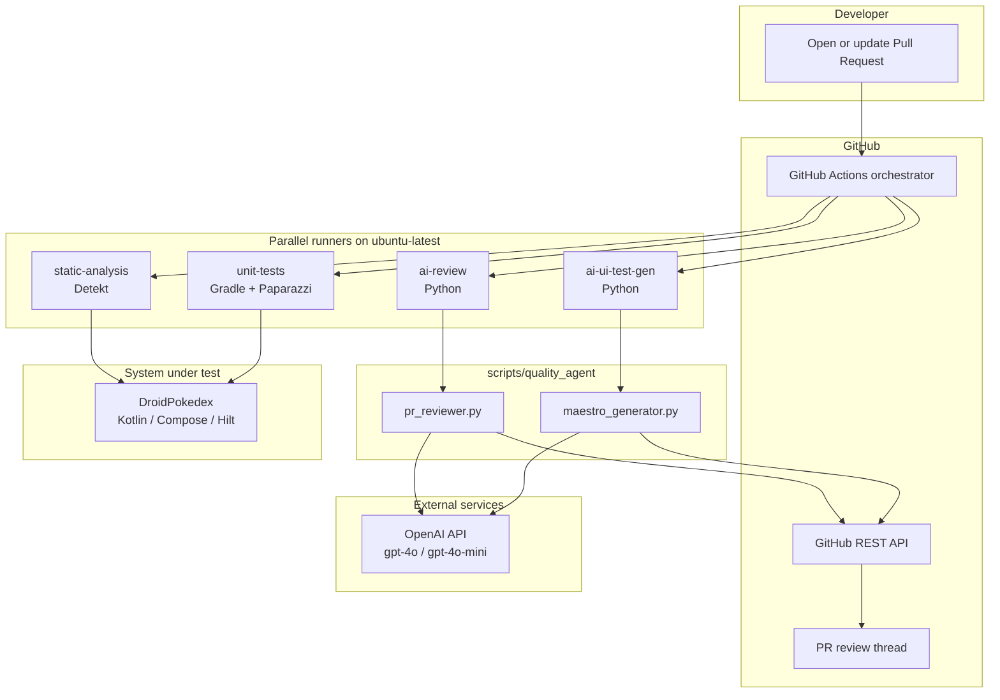
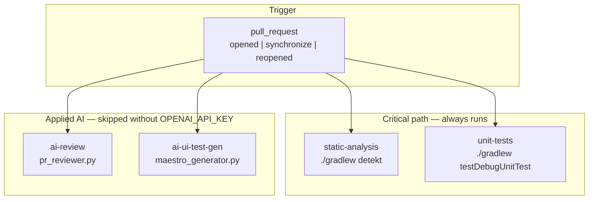
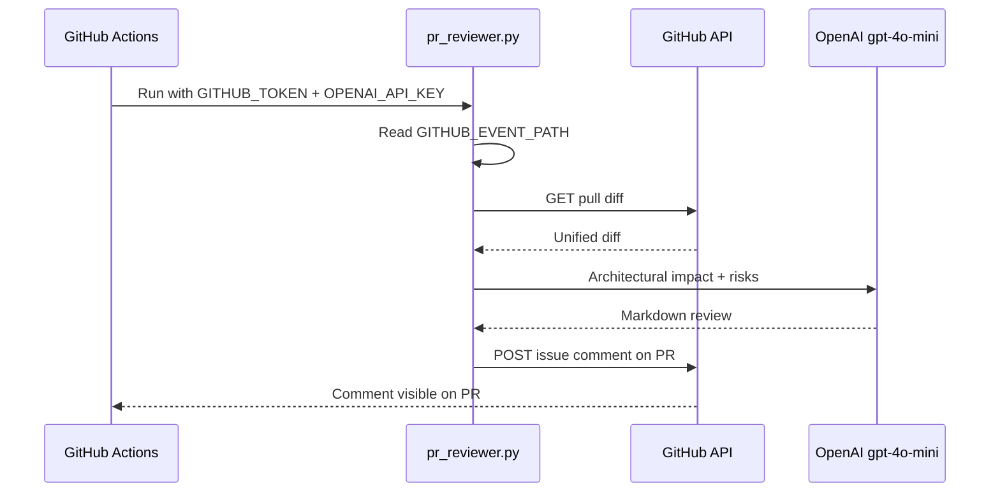
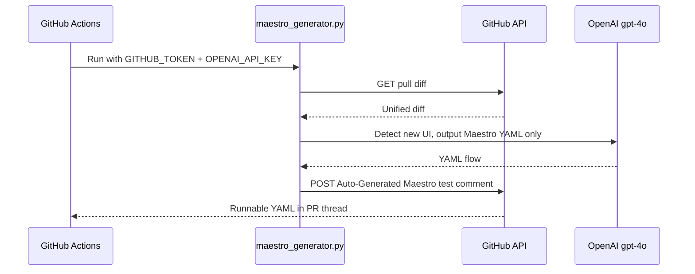
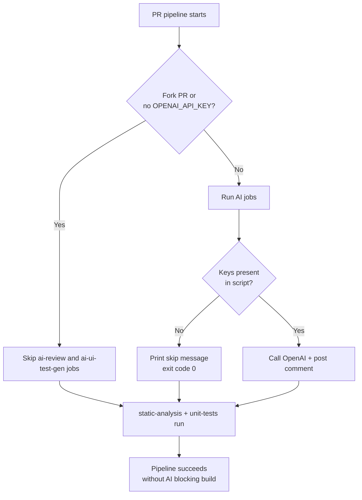
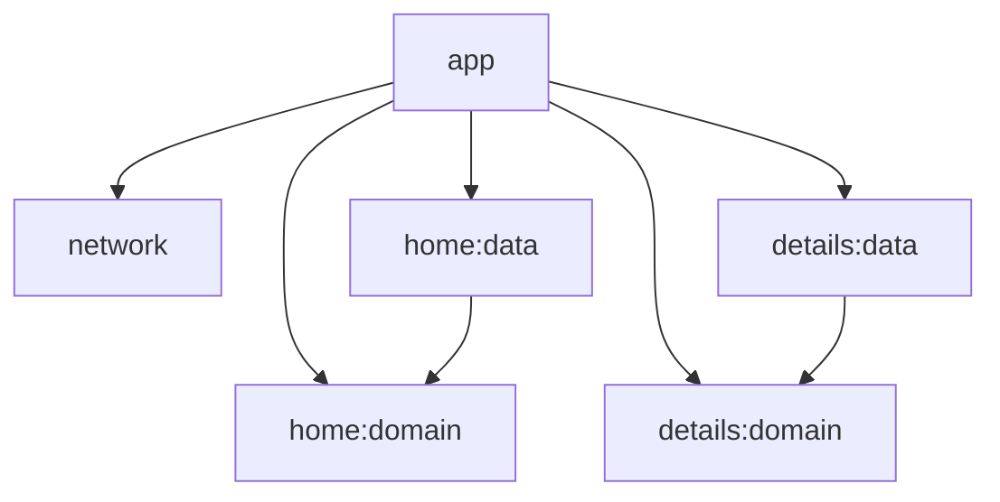

# DroidPokedex

[](https://github.com/alexrodrigues/droidpokedex/actions/workflows/ci.yml)

## 🏗️ AI-Powered Quality Platform & CI/CD Infrastructure

[](https://github.com/alexrodrigues/droidpokedex/actions/workflows/pr_pipeline.yml)
[](scripts/quality_agent/)
[](scripts/quality_agent/)
[](maestro/)

This repository serves as an **enterprise-grade sandbox** for a modern, **decoupled, and parallelized Quality Platform** designed to maximize **developer velocity (DevEx)** and leverage **Applied AI** across the pull-request lifecycle. The Android application below is the system under test; the infrastructure around it demonstrates how static analysis, automated testing, and intelligent agents can run concurrently without blocking the critical path.

### Overview

Quality feedback is delivered through a **PR Pipeline** ([`.github/workflows/pr_pipeline.yml`](.github/workflows/pr_pipeline.yml)) that treats linting, unit verification, and AI-assisted review as **independent concerns**. Each concern executes on its own runner, so developers receive faster, clearer signal on every change. Python-based quality agents live under [`scripts/quality_agent/`](scripts/quality_agent/) and integrate with GitHub’s PR APIs to push insights directly into the review thread.

> **Tip:** Diagrams below use [Mermaid](https://mermaid.js.org/). They render as interactive charts on **GitHub.com**; some local Markdown previews may show only the source block.

### Platform architecture

High-level view of how the Android app, CI runners, and Applied-AI agents relate:


```mermaid
flowchart TB
  subgraph dev [Developer]
    PR[Open or update Pull Request]
  end

  subgraph gh [GitHub]
    GHA[GitHub Actions orchestrator]
    API[GitHub REST API]
    Thread[PR review thread]
  end

  subgraph runners [Parallel runners on ubuntu-latest]
    SA[static-analysis\nDetekt]
    UT[unit-tests\nGradle + Paparazzi]
    AR[ai-review\nPython]
    UG[ai-ui-test-gen\nPython]
  end

  subgraph agents [scripts/quality_agent]
    Reviewer[pr_reviewer.py]
    MaestroGen[maestro_generator.py]
  end

  subgraph external [External services]
    OpenAI[OpenAI API\ngpt-4o / gpt-4o-mini]
  end

  subgraph app [System under test]
    Android[DroidPokedex\nKotlin / Compose / Hilt]
  end

  PR --> GHA
  GHA --> SA
  GHA --> UT
  GHA --> AR
  GHA --> UG
  SA --> Android
  UT --> Android
  AR --> Reviewer
  UG --> MaestroGen
  Reviewer --> API
  MaestroGen --> API
  Reviewer --> OpenAI
  MaestroGen --> OpenAI
  API --> Thread
```

### Parallel pipeline architecture

On every **pull request** opened, synchronized, or reopened against **`main`**, four **concurrent** jobs start on **separate runners**—the layout below matches what you see in the GitHub Actions **graph** view (not a single vertical step list):


```mermaid
flowchart TB
  subgraph trigger [Trigger]
    Event["pull_request\nopened | synchronize | reopened"]
  end

  subgraph critical [Critical path — always runs]
    direction LR
    SA["static-analysis\n./gradlew detekt"]
    UT["unit-tests\n./gradlew testDebugUnitTest"]
  end

  subgraph optional [Applied AI — skipped without OPENAI_API_KEY]
    direction LR
    AR["ai-review\npr_reviewer.py"]
    UG["ai-ui-test-gen\nmaestro_generator.py"]
  end

  Event --> SA
  Event --> UT
  Event --> AR
  Event --> UG
```

| Job | Runtime | Responsibility | Blocks merge? |
|-----|---------|----------------|---------------|
| **`static-analysis`** | Gradle / JVM | Runs **Detekt** for automated Kotlin static analysis and code-quality linting. | Yes (when required by branch protection) |
| **`unit-tests`** | Gradle / JVM | Executes **local unit tests** via Gradle (`testDebugUnitTest`), including JVM snapshot tests (Paparazzi). | Yes |
| **`ai-review`** | Python agent | Intercepts the **Git diff**, analyzes architectural impact via OpenAI, **posts a PR comment** ([`pr_reviewer.py`](scripts/quality_agent/pr_reviewer.py)). | No — optional enrichment |
| **`ai-ui-test-gen`** | Python agent | Detects **new UI surface area**, generates **Maestro YAML**, posts to the PR ([`maestro_generator.py`](scripts/quality_agent/maestro_generator.py)). Baseline: [`maestro/smoke_test.yaml`](maestro/smoke_test.yaml). | No — optional enrichment |

**Workflow entry point:** [`.github/workflows/pr_pipeline.yml`](.github/workflows/pr_pipeline.yml)

### AI agent flows

How each Python agent moves data from the PR to a posted comment:


```mermaid
sequenceDiagram
  participant GHA as GitHub Actions
  participant Script as pr_reviewer.py
  participant GH as GitHub API
  participant LLM as OpenAI gpt-4o-mini

  GHA->>Script: Run with GITHUB_TOKEN + OPENAI_API_KEY
  Script->>Script: Read GITHUB_EVENT_PATH
  Script->>GH: GET pull diff
  GH-->>Script: Unified diff
  Script->>LLM: Architectural impact + risks
  LLM-->>Script: Markdown review
  Script->>GH: POST issue comment on PR
  GH-->>GHA: Comment visible on PR
```


```mermaid
sequenceDiagram
  participant GHA as GitHub Actions
  participant Script as maestro_generator.py
  participant GH as GitHub API
  participant LLM as OpenAI gpt-4o

  GHA->>Script: Run with GITHUB_TOKEN + OPENAI_API_KEY
  Script->>GH: GET pull diff
  GH-->>Script: Unified diff
  Script->>LLM: Detect new UI, output Maestro YAML only
  LLM-->>Script: YAML flow
  Script->>GH: POST Auto-Generated Maestro test comment
  GH-->>GHA: Runnable YAML in PR thread
```

### Resilience and defensive engineering

AI jobs use **defense in depth**: workflow guards first, then script-level graceful exit. The **critical path** never depends on optional AI.


```mermaid
flowchart TD
  Start[PR pipeline starts] --> Fork{Fork PR or\nno OPENAI_API_KEY?}

  Fork -->|Yes| SkipJob[Skip ai-review and ai-ui-test-gen jobs]
  Fork -->|No| RunAI[Run AI jobs]

  SkipJob --> Critical[static-analysis + unit-tests run]
  RunAI --> KeyCheck{Keys present\nin script?}

  KeyCheck -->|No| Exit0[Print skip message\nexit code 0]
  KeyCheck -->|Yes| CallOpenAI[Call OpenAI + post comment]

  Exit0 --> Critical
  CallOpenAI --> Critical

  Critical --> Done[Pipeline succeeds\nwithout AI blocking build]
```

At the **workflow** level, `ai-review` and `ai-ui-test-gen` use `if: secrets.OPENAI_API_KEY != ''`, so they are **skipped entirely** when the secret is unavailable (e.g. **PRs from external forks**). At the **script** level, both agents re-check `OPENAI_API_KEY` and `GITHUB_TOKEN` and **exit 0** if missing—so the critical build path (Detekt + unit tests) never fails because optional AI is unavailable.

---

A Pokédex app for browsing and searching Pokémon using the public [PokéAPI](https://pokeapi.co/). It is built with **Kotlin**, **Jetpack Compose** (Material 3), **Navigation Compose**, and **Hilt** for dependency injection. The project follows a **multi-module, layered structure** (domain / data per feature, shared networking) inspired by Clean Architecture.


## Features

- Paginated Pokémon list with types and artwork (images via **Coil**)
- Search by name
- Detail screen with stats and metadata
- **Remote-first with session cache**: list, search, and detail requests load from [PokéAPI](https://pokeapi.co/) over HTTPS. Repositories keep a **small in-memory cache** (per app process); on **network or HTTP failures** they can return the last successful payload and the UI shows an **offline banner** ([`PokeHomeRepositoryImpl`](home/data/src/main/java/com/rodriguesalex/data/repository/PokeHomeRepositoryImpl.kt), [`PokeDetailsRepositoryImpl`](details/data/src/main/java/com/rodriguesalex/details/data/repository/PokeDetailsRepositoryImpl.kt)). There is **no Room/DataStore disk cache**—data is not persisted across process death.
- **Clearer error states**: failures are classified (no connection, API HTTP errors with status, invalid Pokémon id, generic) and shown with title, message, optional detail, and retry ([`UserErrorMapper`](app/src/main/java/com/rodriguesalex/droidpokedex/util/UserErrorMapper.kt), [`strings.xml`](app/src/main/res/values/strings.xml)).
- **Debug-only HTTP logging**: OkHttp **body** logging runs only when **`BuildConfig.DEBUG`** is true in the `:network` module ([`PokeNetworkModule`](network/src/main/java/com/rodriguesalex/droidpokedex/network/PokeNetworkModule.kt)); release builds do not attach the logging interceptor.

## Requirements

| Item | Version |
|------|---------|
| JDK | 17 |
| `minSdk` | 24 |
| `compileSdk` / `targetSdk` | 36 |

Use a recent **Android Studio** version compatible with the Android Gradle Plugin declared in [`gradle/libs.versions.toml`](gradle/libs.versions.toml) (currently **8.13.0**).

## Getting started

Clone the repository and open the project in Android Studio, or build from the command line:

```sh
git clone https://github.com/alexrodrigues/droidpokedex.git
cd droidpokedex
./gradlew :app:assembleDebug
```

Run unit tests (includes **Paparazzi** snapshot tests under `app/src/test`, which compare against checked-in golden images):

```sh
./gradlew test
```

Generate a unified **JaCoCo** report (domain/data ViewModel tests **and** Compose UI exercised by Paparazzi in `:app`):

```sh
./gradlew jacocoFullReport
```

Open `build/reports/jacoco/html/index.html` for the HTML report. CI runs the same report on every PR and posts coverage from `build/reports/jacoco/jacoco.xml`.

After intentional UI changes, record new Paparazzi baselines:

```sh
./gradlew recordPaparazziDebug
```

## Continuous integration

[GitHub Actions](https://docs.github.com/en/actions) runs on every **push** and **pull request** targeting **`main`**. The workflow is defined in [`.github/workflows/ci.yml`](.github/workflows/ci.yml): it sets up **Temurin JDK 17**, the **Android SDK** (`android-actions/setup-android`), Gradle caching (`gradle/actions/setup-gradle`), then runs **`assembleDebug`**, **`ktlintCheck`**, **`detekt`**, and **`test`** (Gradle may reorder tasks according to the task graph):

```sh
./gradlew assembleDebug ktlintCheck detekt test jacocoFullReport --stacktrace -Dorg.gradle.java.home="$JAVA_HOME"
```

The `-Dorg.gradle.java.home=…` flag matches CI’s JDK with the value from `actions/setup-java` and overrides the optional machine-specific `org.gradle.java.home` entry in [`gradle.properties`](gradle.properties) (for example a local Homebrew path). Instrumented tests on an emulator are not part of this workflow; run those locally when needed.

## Architecture

Modules are declared in [`settings.gradle.kts`](settings.gradle.kts). **Domain** layers expose use cases and repository interfaces; **data** layers implement repositories and Retrofit service interfaces. The **`:network`** module provides a single configured `Retrofit` instance (with `OkHttp` and Gson). Feature data modules depend on **`:feature:domain`** and obtain `Retrofit` through **Hilt** bindings (they do not need a direct Gradle dependency on `:network` for the Retrofit type).

Compose **screens, navigation, and ViewModels** live in **`:app`** under packages such as `home` and `details`. The **`:home`** and **`:details`** Gradle modules are included for a consistent feature layout; the heavy feature code today sits in **`home:domain` / `home:data`** and **`details:domain` / `details:data`**. A natural evolution is to move presentation into those feature modules or toward optional dynamic delivery.


```mermaid
flowchart TB
  app["app"]
  network["network"]
  homeDomain["home:domain"]
  homeData["home:data"]
  detailsDomain["details:domain"]
  detailsData["details:data"]
  app --> network
  app --> homeDomain
  app --> homeData
  app --> detailsDomain
  app --> detailsData
  homeData --> homeDomain
  detailsData --> detailsDomain
```

### Dependency injection (Hilt)

- **`@HiltAndroidApp`** on [`DroidApp`](app/src/main/java/com/rodriguesalex/droidpokedex/DroidApp.kt) bootstraps the application component.
- **`@AndroidEntryPoint`** on [`MainActivity`](app/src/main/java/com/rodriguesalex/droidpokedex/MainActivity.kt) enables field injection in Android components.
- **`@Module` / `@InstallIn(SingletonComponent::class)`** classes (for example [`PokeNetworkModule`](network/src/main/java/com/rodriguesalex/droidpokedex/network/PokeNetworkModule.kt) and feature data modules such as [`PokeHomeDataModule`](home/data/src/main/java/com/rodriguesalex/data/di/PokeHomeDataModule.kt)) bind network and repository implementations at **singleton** scope where appropriate, which keeps a single `Retrofit`/`OkHttp` stack and makes collaborators easy to replace in tests.

### Modules

| Module | Responsibility |
|--------|----------------|
| `:app` | Application entry, Compose UI, navigation, ViewModels, theme, design-system components |
| `:network` | Shared `OkHttp`, Gson, `Retrofit`, and base URL for PokéAPI |
| `:home:domain` | Home feature: models, repository contracts, use cases |
| `:home:data` | Home feature: Retrofit service, repository implementation, Hilt module |
| `:home` | Feature shell (reserved for future UI extraction) |
| `:details:domain` | Details feature: models, contracts, use cases |
| `:details:data` | Details feature: API integration, repository implementation, Hilt module |
| `:details` | Feature shell (reserved for future UI extraction) |

### Design system

Reusable Compose primitives and **@Preview**-backed components live under [`app/.../designsystem`](app/src/main/java/com/rodriguesalex/droidpokedex/designsystem/components/). Additional previews exist on screens such as [`MainActivity`](app/src/main/java/com/rodriguesalex/droidpokedex/MainActivity.kt) and the details flow.

## Testing strategy

| Layer | Approach | Examples |
|-------|----------|----------|
| Domain | JUnit, MockK, coroutines test | [`SearchPokemonUseCaseTest`](home/domain/src/test/java/com/rodriguesalex/domain/SearchPokemonUseCaseTest.kt), [`GetPokeHomeUseCaseTest`](home/domain/src/test/java/com/rodriguesalex/domain/GetPokeHomeUseCaseTest.kt) |
| Data | JUnit, MockK, coroutines test | [`PokeHomeRepositoryImplTest`](home/data/src/test/java/com/rodriguesalex/data/PokeHomeRepositoryImplTest.kt) |
| Presentation | JUnit, MockK, `StandardTestDispatcher` | [`DroidHomeViewModelTest`](app/src/test/java/com/rodriguesalex/droidpokedex/home/viewmodel/DroidHomeViewModelTest.kt), [`DroidDetailsViewModelTest`](app/src/test/java/com/rodriguesalex/droidpokedex/details/viewmodel/DroidDetailsViewModelTest.kt) |
| UI (unit / JVM) | Paparazzi — runs in `testDebugUnitTest`, counts toward JaCoCo | [`DroidHomeCellPaparazziTest`](app/src/test/java/com/rodriguesalex/droidpokedex/DroidHomeCellPaparazziTest.kt), [`DroidDetailsPaparazziTest`](app/src/test/java/com/rodriguesalex/droidpokedex/details/DroidDetailsPaparazziTest.kt) |
| On-device UI | Compose UI test dependencies on `:app` | `androidTest` with `ui-test-junit4` (run on emulator/device) |

Paparazzi is not a separate test suite: it executes with **`./gradlew test`** and feeds the same **`jacocoFullReport`** as ViewModel and domain tests. Screens and design-system code covered by snapshot tests (for example [`DroidDetailsScreenContent`](app/src/main/java/com/rodriguesalex/droidpokedex/details/DroidDetailsScreen.kt)) are included in coverage metrics; `@Preview` composables remain excluded.

## Code quality

Static analysis and formatting are applied from the root [`build.gradle.kts`](build.gradle.kts) using **Detekt** ([`config/detekt/detekt.yml`](config/detekt/detekt.yml)) and **ktlint**.

```sh
./gradlew detekt
./gradlew ktlintCheck
```

To run the default verification pipeline for all modules (unit tests, Android Lint, Detekt, and ktlint):

```sh
./gradlew check
```

## Limitations and possible extensions

- **No durable offline store**: in-memory cache helps during a single run when the API fails; **persisting** lists or details (Room, DataStore, or similar) would improve true offline use and startup after process death. Coil still caches images for URLs on disk where configured.
- **CI** on `main` runs **`assembleDebug`**, **`ktlintCheck`**, **`detekt`**, **`test`** (including Paparazzi), and **`jacocoFullReport`** with PR coverage comments (see [Continuous integration](#continuous-integration)). The full **`./gradlew check`** graph (including Android Lint) is not run in CI unless you add it.
- **Accessibility**: Compose previews help iteration, but a serious pass would add content descriptions, contrast checks, and TalkBack testing—not claimed here.

## Tech stack (summary)

- Kotlin, Jetpack Compose, Material 3, Navigation Compose  
- Hilt, Coroutines, Flow  
- Retrofit, OkHttp, Gson  
- Coil  
- JUnit, MockK, kotlinx-coroutines-test, Paparazzi, Compose UI tests  
- GitHub Actions (build, ktlint, Detekt, unit tests)  

## API

- Base URL: `https://pokeapi.co/api/v2/` (configured in [`PokeNetworkModule`](network/src/main/java/com/rodriguesalex/droidpokedex/network/PokeNetworkModule.kt))
